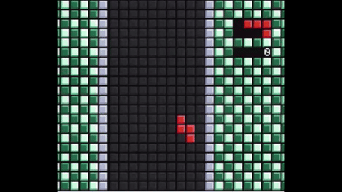

# About this Project

This is a Tetris clone written in C, using raylib for rendering. It doesn't have a proper game over sequence, but the game effectively softlocks once further block placements become impossible. This project was originally a program that rendered to the command line, but I decided to flesh it out by using raylib and drawing some basic assets in Aseprite.

I learned a fair bit when developing the mechanism for storing tetris pieces in memory and rotating them. I found out that I can just store each tetris piece in memory as an 8-bit integer, with one nibble for the top half of the piece, and the other nibble for the bottom half. with some bit math the int can be manipulated to render on the screen in different directions. (This however comes at the cost of not being able to store color data like in past Tetris games, but I just wanted to keep it minimal)

# Building
Haven't tested this on Windows. On Linux and Mac, you should just be able to run `./build.sh` in the project directory and then run `./a.out` and it will run. Just make sure that you have raylib installed on your system.
